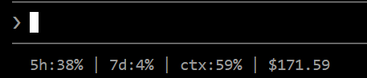

# Claude Code HUD

A live operator HUD for Claude Code's terminal statusline.

Session pressure, weekly quota, context window, and cost estimate, all visible in the terminal while the work is happening.



```
5h:41%(3h16m) | 7d:4%(6d10h) | ctx:61% | $181.22
```

## What each field means

| Field | Meaning | Source |
|-------|---------|--------|
| `5h` | 5-hour rolling session window usage + time until reset | Anthropic plan limit (authoritative) |
| `7d` | 7-day weekly quota usage + time until reset | Anthropic plan limit (authoritative) |
| `ctx` | Context window usage (how full the conversation memory is) | Claude Code runtime (local) |
| `$` | Equivalent API cost estimate for this session (not an invoice) | Claude Code runtime (local) |

The countdown in parentheses (e.g. `3h16m`, `6d10h`) shows time until that usage window resets. It disappears if the reset time is unavailable or already passed.

**Notes:**
- `5h` and `7d` are Anthropic-authoritative plan-limit values fetched from Anthropic's usage API by Claude Code. These are real quota consumption numbers, not estimates. Only available on Pro/Max plans.
- `7d` may lag slightly behind the claude.ai app because Claude Code refreshes rate limit data periodically, not on every render. The countdown is computed locally from the last-received reset timestamp.
- `ctx` and `$` are computed locally by Claude Code and update in real time on every turn. They are runtime values, not Anthropic-authoritative.
- `$` shows what the session would cost at API rates. If you are on a Pro or Max subscription, you are not billed this amount.

## Install

### Quick install

```bash
mkdir -p ~/.claude
curl -fsSL https://raw.githubusercontent.com/SRHSoulja/claude-code-hud/master/claude-code-hud -o ~/.claude/claude-code-hud
chmod +x ~/.claude/claude-code-hud
```

Then add to `~/.claude/settings.json`:

```json
{
  "statusLine": {
    "type": "command",
    "command": "~/.claude/claude-code-hud"
  }
}
```

Restart Claude Code. The HUD appears on the next session start.

### Manual install

Clone this repo or copy the `claude-code-hud` script to any location on your machine. Make it executable with `chmod +x`. Then add the `statusLine` config above, replacing the command path with the real absolute path to wherever you saved the script.

## Optional: JSON snapshot

The HUD can write a JSON snapshot of usage data to disk on every update, so other scripts or tools can read it.

Set the `CLAUDE_HUD_SNAPSHOT` environment variable:

```bash
export CLAUDE_HUD_SNAPSHOT=~/.claude/usage-snapshot.json
```

Or add it to your Claude Code env settings:

```json
{
  "env": {
    "CLAUDE_HUD_SNAPSHOT": "~/.claude/usage-snapshot.json"
  }
}
```

The snapshot contains the same rate limit values shown by `/usage`, plus context window state and session cost.

## Troubleshooting

- **Nothing appears:** Verify the script path in `settings.json` is correct and the file is executable (`chmod +x`).
- **No `5h` or `7d`:** These only appear on Pro/Max subscription plans. `ctx` and `$` work on any plan.
- **`7d` seems stale:** Claude Code refreshes rate limit data periodically, not on every render. It may lag a few minutes behind the claude.ai app.
- **HUD does not update after editing settings.json:** Restart Claude Code. The statusline config is read on session start.

## Compatibility

- Tested on macOS and Linux (bash/zsh).
- Windows users should run Claude Code inside WSL, or adapt the script path for their environment.
- Requires Python 3.6+ (no external dependencies).
- Requires Claude Code v2.1+ (statusline support).

## License

MIT
