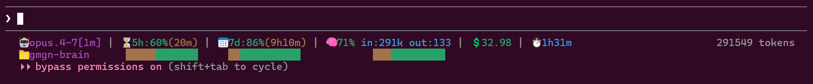

# Claude Code HUD

A live operator HUD for Claude Code's terminal statusline.

Shows model, 5-hour session usage, weekly quota, context window, and cost, with color-coded fuel-gauge bars under each.



- 🤖 Active model + 💲 cost estimate
- ⏳ 5-hour and 📅 7-day quota with countdown to reset (Pro/Max only)
- 🧠 Context window with input/output token counts
- Tri-color fuel gauges: yellow → red at 75% used, green for what's left
- 📁 Anchor showing the current working folder
- Optional JSON snapshot for scripts/dashboards

```
🤖 opus.4-7 | ⏳ 5h:40%(20m) | 📅 7d:14%(9h10m) | 🧠 29% in:291k out:133 | 💲 32.98
📁 my-project   ███████░░░░░    █████████░░░     █████████░░░
```

By default, numbers show **% remaining**, so the green portion of each bar tracks the number you see. Set `CLAUDE_HUD_DIRECTION=used` to flip to count-up — bar fill stays the same, only the number changes.

## What each field means

| Field | Meaning | Source |
|-------|---------|--------|
| `🤖 model` | Active model (e.g. `opus.4-7`). Shows `alias(execution-model)` if a configured alias differs from the runtime model — e.g. `opusplan(sonnet.4-6)` means opusplan mode is set, Sonnet is executing this turn. | Claude Code runtime + `~/.claude/settings.json` |
| `⏳ 5h` | 5-hour rolling session window % remaining + time until reset | Anthropic plan limit (authoritative) |
| `📅 7d` | 7-day weekly quota % remaining + time until reset | Anthropic plan limit (authoritative) |
| `🧠 ctx` | Context window % remaining + token in/out counts | Claude Code runtime (local) |
| `💲 cost` | Equivalent API cost estimate for this session (not an invoice) | Claude Code runtime (local) |
| `📁 folder` | Working directory name (line 2 anchor). Override via `CLAUDE_HUD_ANCHOR`. | `workspace.current_dir` from Claude Code |

The countdown in parentheses (e.g. `20m`, `9h10m`) shows time until that usage window resets. It disappears if the reset time is unavailable or already passed.

**Notes:**

- `5h` and `7d` come from Anthropic's plan-limit API (Pro/Max only); `ctx` and `$` are computed locally by Claude Code on every turn.
- `7d` may lag a few minutes behind the claude.ai app because rate-limit data refreshes periodically, not on every render.
- `$` is what the session would cost at API rates — if you're on a Pro or Max subscription, you're not billed this amount.

## Install

```bash
mkdir -p ~/.claude
curl -fsSL https://raw.githubusercontent.com/SRHSoulja/claude-code-hud/master/claude-code-hud -o ~/.claude/claude-code-hud
chmod +x ~/.claude/claude-code-hud
```

Then add to `~/.claude/settings.json`:

```json
{
  "statusLine": {
    "type": "command",
    "command": "~/.claude/claude-code-hud",
    "refreshInterval": 60
  }
}
```

Start a new Claude Code session. The `statusLine` config is read on session start, so the HUD appears once you open a new session. If you later edit the script itself, changes take effect immediately (no restart needed).

**About `refreshInterval: 60`:** Without it, Claude Code calls the script on every TUI render frame — potentially many times per second. The cap keeps the HUD event-driven (updates every turn) while preventing background flicker on WSL or slower filesystems. Lower it for more frequent polling, or omit it to update only when Claude responds.

### Manual install

Clone this repo or copy the `claude-code-hud` script anywhere on your machine, make it executable with `chmod +x`, then point `statusLine.command` at the absolute path.

## Customization

All customization is via environment variables — set them in your shell or in the `env` block of `~/.claude/settings.json`:

```json
{
  "statusLine": { "type": "command", "command": "~/.claude/claude-code-hud" },
  "env": {
    "CLAUDE_HUD_DIRECTION": "used",
    "CLAUDE_HUD_NO_BARS": "1"
  }
}
```

| Variable | Values | Default | Effect |
|---|---|---|---|
| `CLAUDE_HUD_DIRECTION` | `remaining`, `used` | `remaining` | Number direction. `remaining` = % left (counts down). `used` = % consumed (counts up). Bar fill is identical in both modes; only the displayed number flips. |
| `CLAUDE_HUD_NO_BARS` | `1` | unset | Single-line mode. Drops the line-2 fuel-gauge bars. |
| `CLAUDE_HUD_ANCHOR` | any string | `📁<folder>` | Override the line-2 anchor label. Set to a fixed string if you don't want the working folder shown. |
| `CLAUDE_HUD_SNAPSHOT` | absolute path | unset | Write a machine-readable JSON snapshot on every statusline update (see below). |

## Optional: JSON snapshot

The statusline is for humans. The snapshot is for scripts. It writes machine-readable JSON on every statusline update so your own tools can read current usage state without parsing terminal output.

Examples of what you could build:

- A script that warns you when `5h` crosses 80% used
- A dashboard tracking usage across sessions over time
- A wrapper that pauses heavy work when the weekly quota gets low

Set the path:

```bash
export CLAUDE_HUD_SNAPSHOT=~/.claude/usage-snapshot.json
```

Or via settings.json `env`:

```json
{
  "env": {
    "CLAUDE_HUD_SNAPSHOT": "~/.claude/usage-snapshot.json"
  }
}
```

The snapshot file always stores `used_percentage` (regardless of `CLAUDE_HUD_DIRECTION`) so downstream tools see consistent values:

```json
{
  "source": "claude-code-hud",
  "captured_at": "2026-05-07T05:31:22+00:00",
  "model": "claude-opus-4-7",
  "rate_limits": {
    "five_hour": { "used_percentage": 60, "resets_at": 1746634800 },
    "seven_day": { "used_percentage": 14, "resets_at": 1747200000 }
  },
  "context_window": {
    "used_percentage": 71,
    "total_input_tokens": 291000,
    "total_output_tokens": 133,
    "context_window_size": 1000000
  },
  "cost": { "total_cost_usd": 32.98 }
}
```

## Troubleshooting

- **Nothing appears:** Verify the script path in `settings.json` is correct and the file is executable (`chmod +x`).
- **No `5h` or `7d`:** These only appear on Pro/Max subscription plans. `ctx` and `$` work on any plan.
- **`7d` seems stale:** Claude Code refreshes rate limit data periodically, not on every render. It may lag a few minutes behind the claude.ai app.
- **HUD doesn't appear after editing settings.json:** The `statusLine` config is read on session start — open a new session.
- **Bars look misaligned by a few cells:** Emoji width varies between terminals. The script is calibrated for Windows Terminal / iTerm2 / Alacritty. If you're on a less common terminal and the offsets are off, set `CLAUDE_HUD_NO_BARS=1` for single-line mode.
- **Want to test it manually:** The script reads JSON from stdin. Pipe a sample to it: `echo '{"context_window":{"used_percentage":42}}' | ./claude-code-hud`

## Windows setup

Claude Code runs statusline commands through bash on all platforms. On native Windows, use `python` directly with a bash-resolvable path.

**Install the script** (matches the Linux/macOS layout — single file at `~/.claude/claude-code-hud`):

```powershell
mkdir "$env:USERPROFILE\.claude" -Force
curl -fsSL https://raw.githubusercontent.com/SRHSoulja/claude-code-hud/master/claude-code-hud -o "$env:USERPROFILE\.claude\claude-code-hud"
```

**Add to `~/.claude/settings.json`:**

```json
{
  "statusLine": {
    "type": "command",
    "command": "python ~/.claude/claude-code-hud"
  }
}
```

Requires Python on PATH.

## Compatibility

- **Linux / macOS:** Tested on Linux, should work on macOS the same way
- **WSL:** Same Linux instructions work if Claude Code runs inside WSL
- **Native Windows:** Works. Requires Python on PATH and bash-style command (see Windows setup above)
- Python 3.6+ (no external dependencies)
- Claude Code with statusline support (any recent version)

## License

MIT
